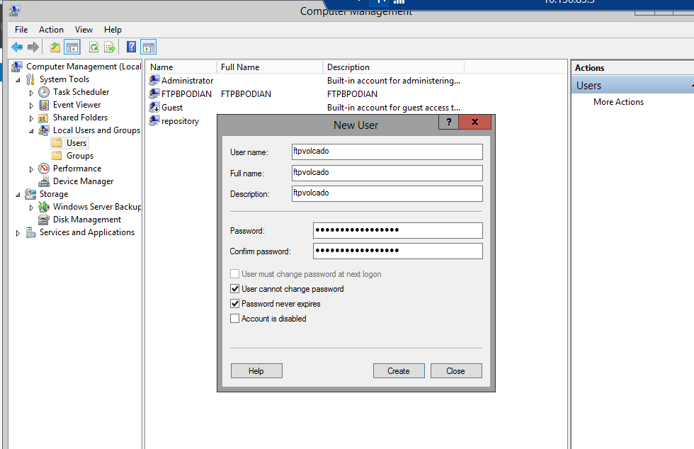
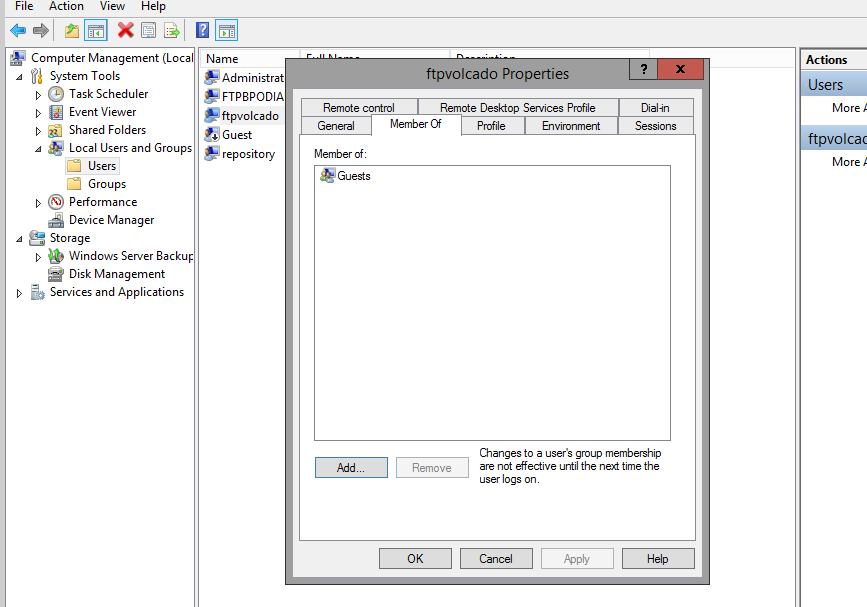
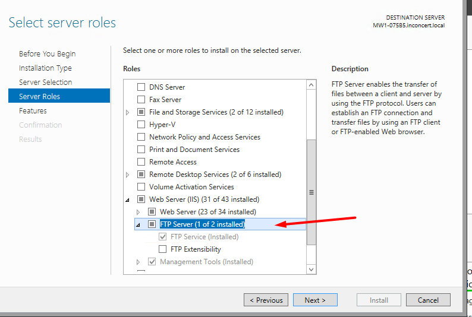
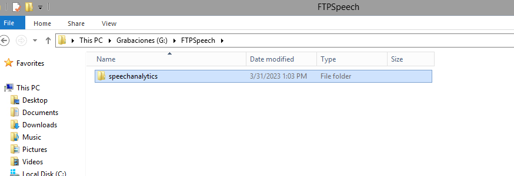
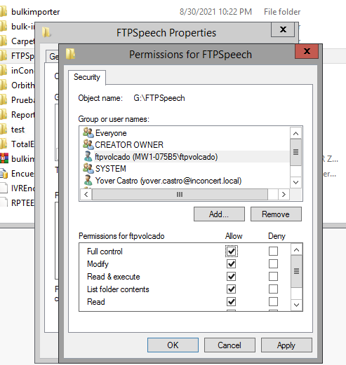
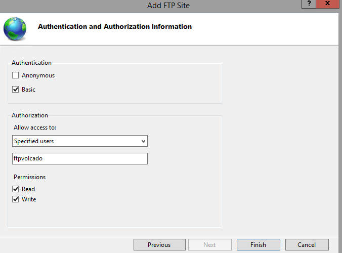
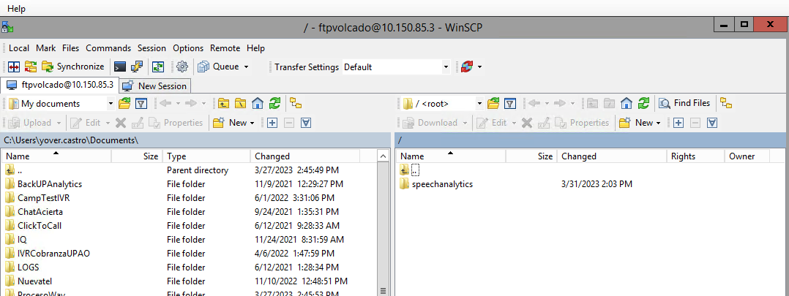

# PROCESO MIXEO EN WAV EN PBX Y SUBIDA DE AUDIOS A SFTP
Speech Analytics habitualmente toma los audios Mixeados en WAV del repositorio de audios alojado en el MW, sin embargo dado que wav ocupa gran cantidad de espacio (se llego a observar en algunos clientes de más de 2TB en 3 meses), se decide configurar un proceso que lleve este Mixeo en WAV a un repositorio dedicado SFTP, para esto los pasos a configurar son los siguientes:

1. Se debe configurar en un servidor Windows el proceso de carga de audios al S3 usando el SDK de Amazon, este servirá como paso intermedio entre las PBXs y el SFTP final.
2. Se debe definir el listado de camapañas cuyos audios se generarán en formato WAV.
3. En cada PBX se configura el mixeo y la subida al FTP alojado en el servidor intermedio Windows del punto 1.
4. Se debe configurar alarmas en las PBXs por si ocurre una acumulación excesiva de archivos.
5. En el MW o un servidor Windows, se deberá configurar un proceso diario (nocturno) que revise en el SFTP externo los audios del dia generados, los guarde en una tabla SQL y genere un csv en este repositorio.

Cada uno de estos puntos estan colocados en sus respectivas carpetas:

1. Configuración FTP en Servidor Intermedio Linux (1. Servidor Linux FTP)
2. Configurar filtrado para generación de WAV (3. Filtrado de generacion WAV por campaña)
3. Configurar en PBX para carga a FTP (4. Servidor PBX)
4. Alarmas en PBX (5. Alarmas)
5. Listado en BD y CSV (6. Listado en BD y CSV)

## 0. REPOSITORIOS:

1. En el caso del SFTP, Infra entrega este repositorio segun solicitud, entregara dominio y credenciales y por default ellos realizan la retencion controlada de 3 meses de audios.
2. Se debe solicitar a Infra un servidor Windows exclusivo, este contendrá el proceso de subida de audios.
3. En el caso del FTP en el servidor Windows intermedio, se tendra que configurar, para ello se debe configurar el sitio FTP en el IIS, aqui una serie de pasos a seguir para realizar esto:

- Crear un usuario de grupo Guest para el FTP (este usuario sera el que se use en el proceso en la PBX y que tendra acceso al FTP del Windows)
Computer Management -> Local Users and Groups -> Add user, colocar una contraseña similar a la del administrador (esto por las restricciones en la contraseña, que deben tener cierta complejidad).




- Habilitar el modulo FTP



- Crear la carpeta FTPSpeech en el disco de negocio. Dentro de esta carpeta crear la carpeta speechanalytics.



- Dar permisos FULL en la carpeta creada (FTPSpeech) al usuario creado.



- Configurar el FTP en el IIS, asignar el puerto disponible (de preferencia el 21) y configurar en la autenticacion al usuario generado.
IIS -> Add site -> FTP site -> Not allow ssl, configure port -> Configurar autenticacion y usuario.



- Validar con WinScp si se tiene conexion y acceso, desde las PBX validar que con un telnet al puerto 21 e IP del MW se pueda acceder.



## 1. CONFIGURACIÓN SERVIDOR INTERMEDIO WINDOWS

Se requiere solamente el archivo zip dentro de la carpeta MW - Windows service, adicionalmente en caso se requiera revisar la fuente se encuentra el proyecto.

### a. Configuraciones previas

- Contar con el FTP configurado.
- Tener conectividad al SFTP destino (se debe solicitar a infra el acces_key, secret_key, nombre del bucket y region del S3).

### b. Deploy proceso de subida

- Copiar el contenido del zip ubicado en la carpeta "1. Servidor Intermedio Windows/Ejecutables/Speech_WinService_RespaldoFTP" en una carpeta del server en la ruta: C:\Program Files (x86)\inConcert\Shared\inConcertSpeechRespaldoSFTP

- Instalar el servicio:

```
- EJECUTO ESTO SI YA EXISTE EL SERVICIO:

sc delete "inConcert SpeechRespaldoSFTP" 

- PARA REGISTRARLO EJECUTO:

C:\Windows\Microsoft.NET\Framework\v4.0.30319\InstallUtil.exe "C:\Program Files (x86)\inConcert\Shared\inConcertSpeechRespaldoSFTP\inConcertSpeechRespaldoSFTP.exe"
```

- Editar el archivo de configuracion (exe.config) con los parametros del servidor (disco) / SFTP.
```
<add key="Temp_Folder" value="E:/FTPSpeech/FTPSpeech1/speechanalytics"/>                                         #RUTA DE LA CARPETA INICIAL EN EL SERVIDOR WINDOWS
<add key="Log_Folder" value="C:\\Program Files (x86)\\inConcert\\Shared\\inConcertSpeechRespaldoSFTP\\Logs\\"/>  #RUTA DE LOGS
<add key="Temp_Directory" value="E:/FTPSpeech/FTPSpeech1"/>                                                      #RUTA DE LA CARPETA INICIAL EN EL SERVIDOR WINDOWS
<add key="cantidad_archivos" value="100"/>                                                                       #CANTIDAD DE ARCHIVOS QUE TOMARA EN CADA EJECUCION
<add key="cantidad_nodos" value="5"/>                                                                            #CANTIDAD DE CARGAS EN PARALELO QUE REALIZARA
<add key="accessKey" value="access_key"/>                                                                        #ACCES_KEY (SOLICITAR A INFRA)
<add key="secretKey" value="secret_key"/>                                                                        #SECRET_KEY (SOLICITAR A INFRA)
<add key="bucketName" value="sftp-us-noverite"/>                                                                 #NOMBRE DEL BUCKET (SOLICITAR A INFRA)
```

- El log quedara en la siguiente ruta: C:\Windows\SysWOW64\config\systemprofile\inConcert\Logs con el nombre de inConcertSpeechRespaldoSFTP.txt

- Tener en cuenta que si se cuenta con diferentes carpetas de carga (en el ejemplo son 6: FTPSPEECH1, FTPSPEECH2, ETC), se deberán crear X cantidad de servicios windows de carga (se edita internamente el nombre del servicio y se siguen los mismos pasos).

La fuente del desarrollo se encuentra en "1. Servidor Intermedio Windows\Fuentes\Speech_WinService_RespaldoFTP".

### b. Proceso de actualización

Es probable que durante la carga algunos audios no se carguen y queden con el nombre "PROCESS_nombredelarchivo", para que se vuelvan a subir simplemente se debe quitar la palabra "PROCESS" del nombre del archivo, para ello se tiene el proceso cuyo ejecutable se encuentra en "1. Servidor Intermedio Windows/Ejecutables/ActualizarCarpeta".

Se deberá actualizar el archivo appSettings.json:
```
{
  "listRemoteDirectory": "E:\\FTPSpeech\\FTPSpeech1\\speechanalytics\\-E:\\FTPSpeech\\FTPSpeech2\\speechanalytics\\-E:\\FTPSpeech\\FTPSpeech3\\speechanalytics\\-E:\\FTPSpeech\\FTPSpeech4\\speechanalytics\\-E:\\FTPSpeech\\FTPSpeech5\\speechanalytics\\",        #LISTA TODAS LAS CARPETAS INICIALES (SEPARADAS POR GUION)
  "diasLimite": "1"                                   #DIAS ANTERIORES EN LOS QUE BUSCARA (SE DEBE DEJAR EN 1)
}
```

La fuente del desarrollo se encuentra en "1. Servidor Intermedio Windows\Fuentes\ActualizarCarpetaLocal".

## 3. Configurar filtrado para generación de WAV
El siguiente paso es modificar store procedures en la BD para que la generación de archivos WAV sea solo para ciertas campañas del ambiente.

En HistoricalData, modificar el sp RepSaveFile, se agregaron las siguientes líneas:
```
--Validacion Toque WAV

	IF @Section >= 900
	BEGIN
		SELECT @Section = @Section - 900
	END
```

Luego, en MMPRODAT, en el sp RecSincronizeAndCheckRecord se modificaron las siguientes líneas:
```
Declare @Campaign varchar(100)
Declare @VCCValidate varchar(100)
```
```
select top 1 @InteractionId = Id, @AttentionNumber = Section,
	@Campaign = InteractionActorDetail.Campaign, @VCCValidate = InteractionActorDetail.VirtualCC 
  from WFUsuLog0227 (nolock) , InteractionActorDetail (nolock), 
  			UserAddressesActive (nolock), UserStates (nolock)
 where Address = @TelAgente
   and IdApplication = 'BarAgent'
   and IdUser	= F1Usua00920227
   And IdChannel = 'TAPI'
   AND (Estado0227 = UserStates.IdState AND (UserStates.VCC = 'SYSTEM' OR WfUsuLog0227.VirtualCC = UserStates.VCC))
   and Actor = F1Usua00920227
   and WFUsuLog0227.VirtualCC = InteractionActorDetail.VirtualCC
   and UserAddressesActive.VCC = InteractionActorDetail.VirtualCC
   and Type = 'TAPI' 
   
order by TimeStamp desc
```
```
Begin

	IF (@VCCValidate in ('womventas') AND @Campaign in ('inbound_emergia','inbound_interactivo','inbound_apex','inbound_gss','inbound_marketmix'))
		BEGIN
          select @AttentionNumber = @AttentionNumber + 900
		END

	Select '1~' + @InteractionId + '~' + Convert(varchar(10), @AttentionNumber)
   End
```
## 4. Configurar en PBXs para carga a FTP

Generalmente se monta el procedimiento sobre PBX que tengan el mixeo en mp3, se requiere configurar el mixeo en wav (separado del mixeo nativo) para subirlo al repositorio FTP del linux intermedio. Se debe validar que el ambiente este configurado para generar audios en mp3 (revisando el archivo tkpostrecording.sh y inconcert.conf), en caso este aplicado la configuracion en wav debera aplicarse rollback a esa configuracion en una ventana. Rollback a las configuraciones indicadas en la guia: [https://inconcert.atlassian.net/wiki/spaces/i6Docs/pages/1126301763/C+mo+setear+el+formato+de+grabaci+n+de+audios+a+.wav]

### a. Setup previo

Copiar los archivos de la carpeta "4. Servidor PBX" en alguna carpeta de la PBX, a fines de la guia se llamara "inicioGrab", ubicado en /home/brt001spt

### b. Crear los directorios que se usaran en el proceso
 
```
mkdir /GrabacionesWAV
mkdir /GrabacionesWAV/q1
mkdir /GrabacionesWAV/q2
mkdir /GrabacionesWAV/q3
mkdir /GrabacionesWAV/q4
mkdir /GrabacionesWAV/q5
mkdir /GrabacionesWAV/qp

mkdir /GrabacionesWAVFailed
mkdir /GrabacionesWAVFailed/q1
mkdir /GrabacionesWAVFailed/q2
mkdir /GrabacionesWAVFailed/q3
mkdir /GrabacionesWAVFailed/q4
mkdir /GrabacionesWAVFailed/q5
mkdir /GrabacionesWAVFailed/qp
```

### c. Copiar los scripts a la ruta /usr/sbin:

Editar en los archivos UploadFilesToFTP.sh y UploadFailedToFTP.sh las credenciales a usar y el número de random number en base a los nodos con los que se trabajará (en este ejemplo son 6 nodos):
```
ftpuser="usuarioftp"
ftppassword="pwd"
recordingremotehost="10.150.93.120"
randomNumber=$(( (RANDOM % 6) + 1 ))
```

Luego mover estos archivos a la siguiente ruta:
- **FTP:**

    ```
    cp /home/brt001spt/inicioGrab/UploadFilesToFTP.sh /usr/sbin/
    cp /home/brt001spt/inicioGrab/UploadFailedToFTP.sh /usr/sbin/
    ```


### d. Asegurar el formato unix y dar permisos a los archivos copiados:

- **FTP:**

    ```
    dos2unix /usr/sbin/UploadFilesToFTP.sh
    dos2unix /usr/sbin/UploadFailedToFTP.sh
    chown -R root:root /usr/sbin/UploadFilesToFTP.sh
    chmod +x /usr/sbin/UploadFilesToFTP.sh
    chown -R root:root /usr/sbin/UploadFailedToFTP.sh
    chmod +x /usr/sbin/UploadFailedToFTP.sh
    ```

### e. Programar crontab, se usa los scripts sh:

```
nano /etc/crontab
```

- **FTP:**

    ```
    # WAV Files to MW
    * * * * * root /usr/sbin/UploadFilesToFTP.sh 1;
    * * * * * root /usr/sbin/UploadFilesToFTP.sh 2;
    * * * * * root /usr/sbin/UploadFilesToFTP.sh 3;
    * * * * * root /usr/sbin/UploadFilesToFTP.sh 4;
    * * * * * root /usr/sbin/UploadFilesToFTP.sh 5;

    * * * * * root /usr/sbin/UploadFailedToFTP.sh 1;
    * * * * * root /usr/sbin/UploadFailedToFTP.sh 2;
    * * * * * root /usr/sbin/UploadFailedToFTP.sh 3;
    * * * * * root /usr/sbin/UploadFailedToFTP.sh 4;

### f. Editar el archivo /usr/sbin/tkpostrecording.sh

Se recomienda en primer paso hacer un backup:

```
mkdir /home/brt001spt/backupscambiowav/
cp -p /usr/sbin/tkpostrecording.sh /home/brt001spt/backupscambiowav/tkpostrecording.sh
```
Luego modificar el archivo para incluir las siguientes líneas:

```
#Validacion WAV
	grabarWAV=0
    mustWAV=$(echo $in_file | awk -F "_" {'print $2'})
    logInfo "Valor de mustWAV:  $mustWAV" 
    # Verificar si el segundo campo esta modificado
    if [[ "$mustWAV" =~ ^[0-9]+$ ]]; then
        if [ "$mustWAV" -ge 900 ]; then
            logInfo "El segundo campo es mayor o igual a 900 Se mixea en WAV"
			grabarWAV=1
        else
            logInfo "No se mixea en WAV" 
        fi
    fi
```

Debajo de cada generación de audio se debe agregar la siguiente línea:
```
#Validacion WAV
			if [ "$grabarWAV" -eq 1 ]; then
				logInfo "Mixeando en WAV"
				echo "$cmdDebian -M $recordingremotedir/$queueName/$out_file $recordingremotedir/$queueName/$in_file /GrabacionesWAV/$queueName/$callId.wav && " >> $recordingdir/$callId.prs	
			fi
```
La cual validará si el audio de la interacción se generará en WAV o no. Tener en cuenta que se debe agregar "&&" dentro del comando echo de cada generación de audio:
Por ejemplo, esta linea estaba así:
```
echo "$cmdDebian $recordingremotedir/$queueName/$out_file $recordingremotedir/$queueName/$in_file $recordingremotedir/$queueName/$callId.mp3" >> $recordingdir/$callId.prs
```
Y ahora deberia estar asi:
```
echo "$cmdDebian $recordingremotedir/$queueName/$out_file $recordingremotedir/$queueName/$in_file $recordingremotedir/$queueName/$callId.mp3 && " >> $recordingdir/$callId.prs
```
Una vez realizado ello, ya comenzarán a generarse audios WAV para las campañas del punto 3, y deberían estar llegando al FTP del servidor linux. Finalmente, del servidor linux estarán siendo enviadas al SFTP final.

## 5. Alarmas en PBX:
Para el proceso se configura una alarma que valida la cantidad de archivos y en caso el número sea elevado envia una notificación email.

Para ello primero se debe instalar la libreria msmtp en las PBXs (no requiere ningún reinicio):
```
apt-get -y install msmtp
```

Luego en el archivo de configuración se debe colocar lo siguiente:
```
nano ~/.msmtprc
```
```
     # A system wide configuration is optional.
     # If it exists, it usually defines a default account.
     # This allows msmtp to be used like /usr/sbin/sendmail.
     defaults
     auth on
     tls on
     tls_starttls on
     tls_trust_file /etc/ssl/certs/ca-certificates.crt

     account office365
     host smtp.office365.com
     port 587
     from alarms@inconcert.global
     user alarms@inconcert.global
     password poner_password_de_la_cuenta

     account default : office365

     # Use TLS.
     #tls on
     #tls_trust_file /etc/ssl/certs/ca.pem

     # Syslog logging with facility LOG_MAIL instead of the default LOG_USER.
     syslog LOG_MAIL

```
Para validar que el envio funciona correctamente se puede ejecutar la siguiente linea:
```
echo -e "Subject: Fallo Proceso WAV\n\nEl proceso de generacion de audios en WAV se detuvo debido a una falla que causo acumulacion de archivos" | msmtp -a office365 -t "paulo.martinez@inconcertcc.com" -f alarms@inconcert.global
```

### a. Alarma para las PBXs:
En cada PBX, crear la carpeta:
```
mkdir ControlProcesoWAV
```
La carpeta contendrá los siguientes archivos (se pueden encontrar en la carpeta 5 en "LINUX"):
a. archivo_control.txt
b. ControlProcesoWAV.sh
c. tkpostrecordingOn.sh (representa el tkpostrecording.sh con los cambios para la generación en WAV)
d. tkpostrecordingOff.sh (representa el tkpostrecording.sh sin cambios)

Dar formato a archivo:
```
dos2unix /ControlProcesoWAV/ControlProcesoWAV.sh
chown -R root:root /ControlProcesoWAV/ControlProcesoWAV.sh
chmod +x /ControlProcesoWAV/ControlProcesoWAV.sh
```
Agregar al contrab la siguiente linea
```
* * * * * root /ControlProcesoWAV/ControlProcesoWAV.sh;
```

Con esto se estará validando cada minuto la cantidad de archivos de las carpetas de GrabacionesWAV y GrabacionesWAVFailed de las PBXs.
Si el proceso se detiene por carga de archivos, se debe revisar que esta generando el encolamiento, posterior a ello se puede activar el proceso de control poniendo "EJECUTAR" como contenido del archivo de control.

## 6. Listado en BD y en CSV:

En un servidor Windows (puede ser el MW), crear la carpeta tmpAudios por ejemplo (modificar según el disco que se tenga):
```
R:\tmpAudios
```
Y en su interior crear un archivo vacio llamado fileDetails.csv
Finalmente, dar clic derecho en la carpeta, poner SharedWith>SpecificPeople>Everyone y dar en Aceptar. Deberá aparecer una pantalla con una ruta como esta:
```
\\MW1-A6BC9\tmpAudios
```
Esta es la ruta compartida que se usará desde la BD para dejar el archivo CSV.

En la tabla de negocio se deberá crear la siguiente tabla:
```
USE [WomVentas]
GO

/****** Object:  Table [dbo].[DatosArchivosAudios]    Script Date: 04/04/2024 1:23:14 ******/
SET ANSI_NULLS ON
GO

SET QUOTED_IDENTIFIER ON
GO

CREATE TABLE [dbo].[DatosArchivosAudios](
	[file] [varchar](500) NOT NULL,
	[location] [varchar](500) NULL,
	[creationDate] [date] NULL,
 CONSTRAINT [PK_DatosArchivosAudios] PRIMARY KEY CLUSTERED 
(
	[file] ASC
)WITH (PAD_INDEX = OFF, STATISTICS_NORECOMPUTE = OFF, IGNORE_DUP_KEY = OFF, ALLOW_ROW_LOCKS = ON, ALLOW_PAGE_LOCKS = ON) ON [PRIMARY]
) ON [PRIMARY]
GO
```
En la tabla de negocio se deberá crear el siguiente sp:
```
USE [WomVentas]
GO
/****** Object:  StoredProcedure [dbo].[BulkArchivosAudios]    Script Date: 04/04/2024 1:25:01 ******/
SET ANSI_NULLS ON
GO
SET QUOTED_IDENTIFIER ON
GO

CREATE PROCEDURE [dbo].[BulkArchivosAudios]
AS
BEGIN
	BEGIN TRY
		bulk insert dbo.DatosArchivosAudios
		from '\\MW1-A6BC9\tmpAudios\fileDetails.csv'
		with
		(
			FIRSTROW = 2 ,
			FIELDTERMINATOR = ';',
			ROWTERMINATOR = '\n', 
			MAXERRORS = 1000000000,
			CODEPAGE = 'ACP'
		)
	END TRY
	BEGIN CATCH
	END CATCH
END
```

Luego crear la siguiente ruta en el SFTP:
```
/procesados/listasAudios/
```
Luego, subir el proceso de listado de audios "Ejecutable.zip" (carpeta 6. Listado en BD y CSV), y mediante un task scheduler poner que se ejecute de forma diaria en la madrugada. Lo que hara el proceso es listar todos los archivos del audio anterior.
En el archivo appSettings.json modificar las siguientes lineas en base a lo requerido:
```
{
  "sftpHost": "usftpcorp.inconcertcc.com",   									//dominio del SFTP
  "sftpPath": "/speechanalytics/",   	     									//ruta raíz del SFTP
  "sftpArchivoLista": "/procesados/listasAudios/", 								//ruta del SFTP donde se depositarán los archivos CSV
  "sftpFingerPrint": "ssh-ed25519 255 .......",									//fingerprint para conexion al SFTP
  "sftpUsername": "womcolombia-user",										//usuario SFTP
  "sftpPassword": "pwd",											//password SFTP
  "rutaArchivoCSV": "r:\\tmpAudios\\fileDetails.csv",								//ruta del server MW para referenciar la generación del archivo
  "spBulk": "EXEC WomVentas..BulkArchivosAudios;",								//SP de bulk de data
  "cabecera": "file;location;creationDate",									//cabecera fija (no cambia)
  "dataSource": "Data Source=172.16.227.114;Initial Catalog=WomVentas;User ID=UsrAccMw;Password=poner_pwd",	//definicion de la BD a usar
  "timeout_win": "10",												//timeout de conexion en segundos
  "diaListar": "1"												//dia atras que se listara (en 1 significa que listará los archivos del dia anterior)
}
```

Este proceso generará los registros en BD y en un CSV.
Si se requiere revisar las fuentes, se encuentran en el zip "ListarAudiosSFTP"
