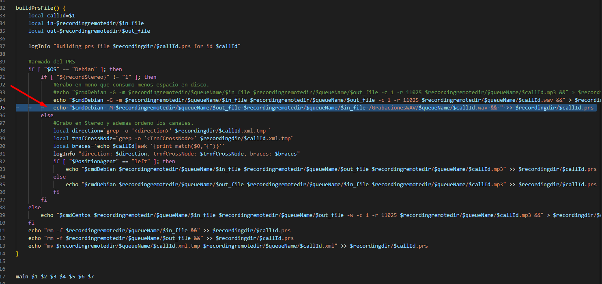
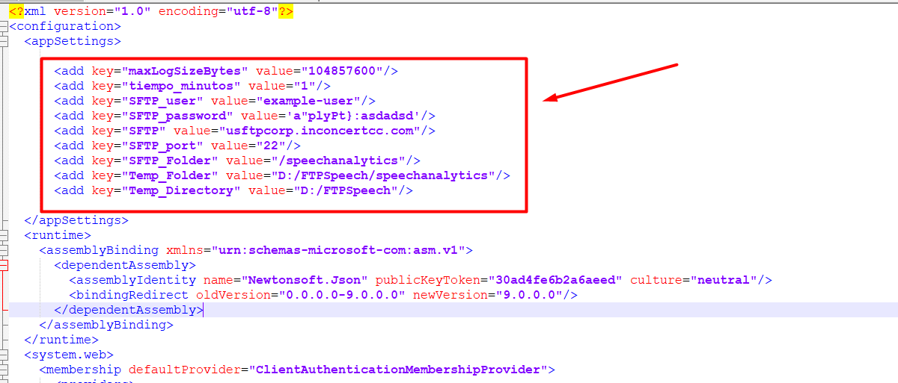

# PROCESO MIXEO EN WAV EN PBX Y SUBIDA DE AUDIOS A SFTP

Speech Analytics habitualmente toma los audios Mixeados en WAV del repositorio de audios alojado en el MW, sin embargo dado que wav ocupa gran cantidad de espacio (se llego a observar en algunos clientes de más de 2TB en 3 meses), se decide configurar un proceso que lleve este Mixeo en WAV a un repositorio dedicado SFTP, para esto los pasos a configurar son los siguientes:

1. En cada PBX se configura el mixeo y la subida a un FTP alojado en un nodo de MW (MW1).

2. En el MW1, se tiene el FTP con la carpeta que contiene los audios provenientes de todas las PBX del ambiente. Se debe configurar un windows service que se encargara de mover estos audios al repositorio SFTP indicado.

3. En el MW1 adicionalmente, se deberá configurar un proceso diario (nocturno) que revise en el SFTP externo los audios del dia generados, los guarde en una tabla SQL y genere un csv en este repositorio.

Cada uno de estos puntos estan colocados en sus respectivas carpetas:

1. PBX

2. MW - Windows service

3. _Pendiente_

## 0. REPOSITORIOS:

1. En el caso del SFTP, Infra entrega este repositorio segun solicitud, entregara dominio y credenciales y por default ellos realizan la retencion controlada de 3 meses de audios.

2. En el caso del FTP en el MW, si no esta montado se tendra que configurar, para ello se debe configurar el sitio FTP en el IIS, aqui una serie de pasos a seguir para realizar esto (si ya se cuenta con FTP en el MW se puede pasar al siguiente punto de PBX):

- Crear un usuario de grupo Guest para el FTP (este usuario sera el que se use en el proceso en la PBX y que tendra acceso al FTP del MW)
Computer Management -> Local Users and Groups -> Add user, colocar una contraseña similar a la del administrador (esto por las restricciones en la contraseña, que deben tener cierta complejidad).


- Habilitar el modulo FTP


- Crear la carpeta FTPSpeech en el disco de negocio. Dentro de esta carpeta crear la carpeta speechanalytics.


- Dar permisos FULL en la carpeta creada (FTPSpeech) al usuario creado.


- Configurar el FTP en el IIS, asignar el puerto disponible (de preferencia el 21) y configurar en la autenticacion al usuario generado.
IIS -> Add site -> FTP site -> Not allow ssl, configure port -> Configurar autenticacion y usuario.


- Validar con WinScp si se tiene conexion y acceso, desde las PBX validar que con un telnet al puerto 21 e IP del MW se pueda acceder.


## 1. CONFIGURACIÓN PBX

Generalmente se monta el procedimiento sobre PBX que tengan el mixeo en mp3, se requiere configurar el mixeo en wav (separado del mixeo nativo) para subirlo a un repositorio FTP o SFTP que sera usado posteriormente por SpeechAnalytics o QA. Se debe validar que el ambiente este configurado para generar audios en mp3 (revisando el archivo tkpostrecording.sh y inconcert.conf), en caso este aplicado la configuracion en wav debera aplicarse rollback a esa configuracion en una ventana. Rollback a las configuraciones indicadas en la guia: [https://inconcert.atlassian.net/wiki/spaces/i6Docs/pages/1126301763/C+mo+setear+el+formato+de+grabaci+n+de+audios+a+.wav]

### a. Setup previo

Copiar los archivos del repositorio en alguna carpeta de la PBX, a fines de la guia se llamara "inicioGrab", ubicado en /home/brt001spt

### b. Crear los directorios que se usaran en el proceso
 
```
mkdir /GrabacionesWAV
mkdir /GrabacionesWAV/q1
mkdir /GrabacionesWAV/q2
mkdir /GrabacionesWAV/q3
mkdir /GrabacionesWAV/q4
mkdir /GrabacionesWAV/q5
mkdir /GrabacionesWAV/qp

mkdir /GrabacionesWAVFailed
mkdir /GrabacionesWAVFailed/q1
mkdir /GrabacionesWAVFailed/q2
mkdir /GrabacionesWAVFailed/q3
mkdir /GrabacionesWAVFailed/q4
mkdir /GrabacionesWAVFailed/q5
mkdir /GrabacionesWAVFailed/qp
```

### c. Copiar los scripts a la ruta /usr/sbin:

- **FTP:**

    ```
    cp /home/brt001spt/inicioGrab/UploadFilesToFTP.sh /usr/sbin/
    cp /home/brt001spt/inicioGrab/UploadFailedToFTP.sh /usr/sbin/
    ```


### d. Asegurar el formato unix y dar permisos a los archivos copiados:

- **FTP:**

    ```
    dos2unix /usr/sbin/UploadFilesToFTP.sh
    dos2unix /usr/sbin/UploadFailedToFTP.sh
    chown -R root:root /usr/sbin/UploadFilesToFTP.sh
    chmod +x /usr/sbin/UploadFilesToFTP.sh
    chown -R root:root /usr/sbin/UploadFailedToFTP.sh
    chmod +x /usr/sbin/UploadFailedToFTP.sh
    ```

### e. Programar crontab, se usa los scripts sh:

```
nano /etc/crontab
```

- **FTP:**

    ```
    # WAV Files to MW
    * * * * * root /usr/sbin/UploadFilesToFTP.sh 1;
    * * * * * root /usr/sbin/UploadFilesToFTP.sh 2;
    * * * * * root /usr/sbin/UploadFilesToFTP.sh 3;
    * * * * * root /usr/sbin/UploadFilesToFTP.sh 4;
    * * * * * root /usr/sbin/UploadFilesToFTP.sh 5;

    * * * * * root /usr/sbin/UploadFailedToFTP.sh 1;
    * * * * * root /usr/sbin/UploadFailedToFTP.sh 2;
    * * * * * root /usr/sbin/UploadFailedToFTP.sh 3;
    * * * * * root /usr/sbin/UploadFailedToFTP.sh 4;
    * * * * * root /usr/sbin/UploadFailedToFTP.sh 5;
    ```

### f. Editar los archivos sh que suben al repositorio, segun corresponda al caso de aplicacion (FTP o SFTP)


- **FTP: /usr/sbin/UploadFilesToFTP.sh y /usr/sbin/UploadFailedToFTP.sh**

Se debe editar con los datos correspondientes del servidor FTP y en el servidor FTP se debe configurar la carpeta speechanalytics donde se dejaran los audios:

1. Crear carpeta "speechanalytics" en el servidor FTP
2. Editar los siguientes campos acorte a los datos del FTP:

    ```
    ftpuser="administrator"
    ftppassword="PassWordFTP123"
    recordingremotehost="10.150.71.3"
    remotedirPath="/speechanalytics"
    ```

Se puede editar el puerto usado en el caso del FTP, el parametro -P 21 es el puerto, que puede modificarse segun se requiera:

```
cmd="ncftpput -V -t 10 -u $ftpuser -p $ftppassword -P 21 -m $recordingremotehost"
```

### g. Editar el archivo /usr/sbin/tkpostrecording.sh

Se recomienda en primer paso hacer un backup:

```
mkdir /home/brt001spt/backupscambiowav/
cp -p /usr/sbin/tkpostrecording.sh /home/brt001spt/backupscambiowav/tkpostrecording.sh
```

Añadir la siguiente linea en el archivo tkpostrecording en la funcion buildPrsFile(), se usa el flag -M para indicar que es un mixeo de ambas partes y se usa la configuracion de positionAgent "Right" segun lo sugerido por la guia "Cómo setear el formato de grabación de audios a .wav" [https://inconcert.atlassian.net/wiki/spaces/i6Docs/pages/1126301763/C+mo+setear+el+formato+de+grabaci+n+de+audios+a+.wav]:

```
echo "$cmdDebian -M $recordingremotedir/$queueName/$out_file $recordingremotedir/$queueName/$in_file /GrabacionesWAV/$queueName/$callId.wav && " >> $recordingdir/$callId.prs
```

Tambien pueden visualizarlo en la imagen:



## 2. CONFIGURACIÓN MW

Se requiere solamente el archivo zip dentro de la carpeta MW - Windows service, adicionalmente en caso se requiera revisar la fuente se encuentra el proyecto.

### a. Configuraciones previas

- Contar con el FTP configurado.
- Tener conectividad al SFTP destino (validado con WinSCP desde el servidor).

### b. Deploy

- Copiar el contenido del zip en una carpeta en la ruta: C:\Program Files (x86)\inConcert\Shared\inConcertSpeechRespaldoSFTP

- Instalar el servicio:

```
- EJECUTO ESTO SI YA EXISTE EL SERVICIO:

sc delete "inConcert SpeechRespaldoSFTP" 

- PARA REGISTRARLO EJECUTO:

C:\Windows\Microsoft.NET\Framework\v4.0.30319\InstallUtil.exe "C:\Program Files (x86)\inConcert\Shared\inConcertSpeechRespaldoSFTP\inConcertSpeechRespaldoSFTP.exe"
```

- Editar el archivo de configuracion con los parametros del servidor (disco) / SFTP.



- El log quedara en la siguiente ruta: C:\Windows\SysWOW64\config\systemprofile\inConcert\Logs con el nombre de inConcertSpeechRespaldoSFTP.txt